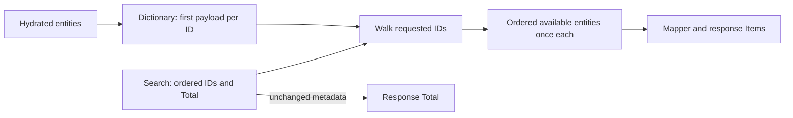

# Trace identities, payloads and total independently

The helper builds a dictionary from hydrated entities using `TryAdd`, then walks requested IDs and removes each found entry after adding it to output. The first hydrated payload wins for an identity. Removal ensures that repeated requests emit that identity once. Membership comes from requested IDs, so unrequested hydrated rows never enter the response.

## Worked case A — missing and extra entities

Requested IDs are `[B, M, A]`. Hydration returns `[(A, alpha), (X, extra), (B, beta)]`. Dictionary construction stores all three hydrated identities. The requested pass finds B and emits beta, cannot find M, then finds A and emits alpha. X stays unused. Output is B then A, not X then A then B and not B then A then X.

| Request step | Lookup result | Output after step |
|---|---|---|
| B | beta, removed from dictionary | B:beta |
| M | missing | B:beta |
| A | alpha, removed | B:beta, A:alpha |

This distinction matters when reviewing a patch that assigns extras a large sort key. Such a patch changes position without enforcing membership. “All expected entities appear” is a weaker assertion than “exactly the expected ordered entities appear.”

## Worked case B — duplicate request and payload

Requested IDs are `[B, A, B, A]`. Hydration returns `[(A, a-first), (B, b-first), (B, b-later), (A, a-later)]`. `TryAdd` keeps a-first and b-first. The first B/A request occurrences consume those entries; later occurrences have nothing left to emit. Expected payloads are b-first then a-first.

Now reverse hydration. The selected payload for each duplicate identity can change because “first hydrated” is the documented policy. Do not assert invariance under arbitrary hydration permutations when duplicates have different data. For distinct identities, reordering hydration should not change requested output order.

## Worked case C — total is not page length

Search returns an empty page and total 17. The controller short-circuits before hydration or mapping and returns empty Items with Total 17. Total describes the search result set, not the number of hydrated entities currently returned. Missing entities on a nonempty page can similarly reduce Items without changing the service-supplied total.

This can expose an index/entity consistency issue worth investigating, but the helper does not repair that upstream consistency. It implements a deterministic selection contract under the supplied data.

## Complexity and evidence

A dictionary pass over hydrated rows and a pass over requested IDs provide expected linear work under ordinary dictionary-operation assumptions. Repeated linear searches for requested positions add unnecessary work as lists grow. Unit tests can establish identities, order, payload choice and skipped calls. They do not measure production latency or prove a worst-case complexity guarantee for every dictionary implementation.

Try the [worksheet](labs/README.md) before reading the answers. For each row, write separate columns for output IDs, output aliases and Total. This prevents a correct order from hiding an incorrect payload or metadata value.
